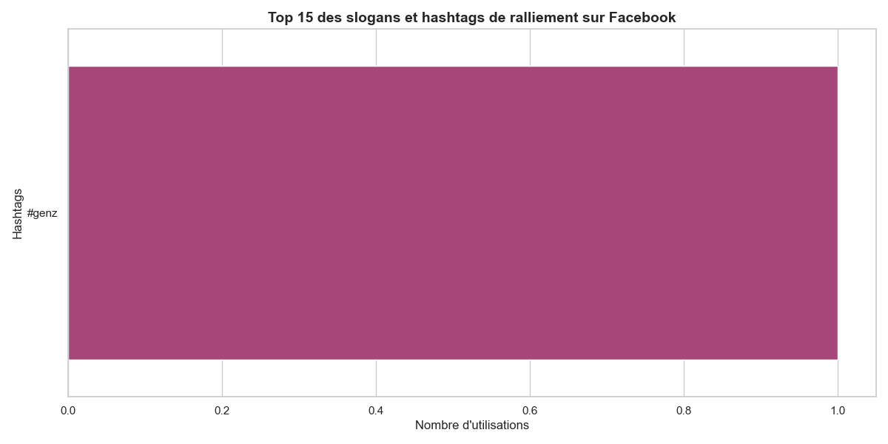

# 📊 Text Mining & Sentiments : L'Enquêteur du Niger
> **Une analyse empirique de la ligne éditoriale et de l'engagement citoyen durant la transition de l'AES.**

---

## 🎯 Présentation & Objectifs de l'Étude

Ce projet propose une analyse approfondie et multidimensionnelle des publications de **L'Enquêteur**, un média influent au Niger. L'étude couvre une période historique charnière allant de l'investiture du **26 Mars 2025 jusqu'à aujourd'hui (Juillet 2026)**.

### 🔍 Problématique
Comment un média souverainiste structure-t-il son discours autour de la transition politique au Niger et de l'Alliance des États du Sahel (AES) ? De quelle manière son audience réagit-elle à cette ligne éditoriale ?

### 📈 Objectifs clés :
* **Cartographier les thématiques majeures** abordées par le média (Souveraineté, Sécurité, Économie, etc.).
* **Mesurer la charge émotionnelle (polarité)** et le degré d'opinion (**subjectivité**) des articles grâce au Traitement Automatique du Langage Naturel (TALN / NLP).
* **Analyser l'engagement de l'audience** (likes, partages, commentaires, types de réactions Facebook) en corrélation avec le ton des publications.
* **Proposer une synthèse visuelle claire** pour faciliter l'interprétation des dynamiques d'opinion.

---

## 🛡️ Collecte de Données & Éthique (Scraping Facebook)

Le jeu de données utilisé pour cette étude a été constitué via un processus d'extraction de données publiques (scraping) sur la page officielle Facebook de *L'Enquêteur*.

> ⚖️ **Déclaration de conformité et d'éthique :**
> * **Nature des données :** Seules les données publiées publiquement par la page média (textes des posts, métadonnées d'engagement anonymisées et agrégées) ont été collectées. Aucune donnée personnelle, privée ou sensible d'utilisateur n'a été extraite.
> * **Respect de la plateforme :** Les scripts de collecte ont appliqué des limites de requêtes (*rate-limiting*) et des délais stricts afin de ne pas perturber les serveurs de la plateforme hôte (respect des bonnes pratiques d'accès web).
> * **Cadre d'utilisation :** Cette collecte s'inscrit exclusivement dans un **cadre académique, scientifique et non commercial**, respectant l'usage loyal des données publiques à des fins de recherche.

---

## 🛠️ Architecture du Projet

Le projet est structuré de manière modulaire pour garantir sa reproductibilité :
* `data/` : Contient les datasets (bruts et nettoyés après traitement NLP).
* `notebooks/` : Notebooks Jupyter étape par étape (Scraping, Tokenisation, Sentiment, Topic Modeling, Visualisation).
* `outputs/figures/` : Dossier contenant l'ensemble des graphiques générés automatiquement.
* `src/` : Scripts Python utilitaires pour le nettoyage du texte.

---

## 🖼️ Galerie des Figures & Analyses

*Note : Les figures ci-dessous sont générées automatiquement par le script de visualisation et enregistrées dans le dossier `outputs/figures/`.*

### I. Analyse Textuelle & Mots-Clés

#### Figure 1 : Nuage de mots global (avant filtrage de mots parasites(mais, pas , ect...) évidemment négatifs)

> 📝 **Interprétation :**
> *Remplacer ce texte par votre analyse. Décrivez ici les termes les plus volumineux (ex: Souveraineté, AES, Transition...) et ce qu'ils révèlent sur les priorités éditoriales du média.*
---

#### Figure 1 : Nuage de mots global (filtré)

> 📝 **Interprétation :**
> *Remplacer ce texte par votre analyse. Décrivez ici les termes les plus volumineux (ex: Souveraineté, AES, Transition...) et ce qu'ils révèlent sur les priorités éditoriales du média.*

---

#### Figure 2 : Top 20 des mots les plus fréquents

> 📝 **Interprétation :**
> *Remplacer ce texte par votre analyse. Notez la cohérence avec le nuage de mots et commentez l'absence des mots vides (grâce à notre filtre stop-words personnalisé).*

---

#### Figure 3 : Top 15 des Slogans & Hashtags de ralliement

> 📝 **Interprétation :**
> *Remplacer ce texte par votre analyse. Identifiez ici les hashtags les plus fédérateurs et leur portée militante ou informative sur les réseaux.*

---

### II. Analyse de Sentiment & Intensité

#### Figure 4 : Distribution de la Polarité (Le ton général)

> 📝 **Interprétation :**
> *Remplacer ce texte par votre analyse. Le ton du journal est-il globalement neutre, ultra-positif (soutien) ou négatif (dénonciation des menaces/impérialisme) ? Que dit la valeur moyenne ?*

---

#### Figure 5 : Positionnement sémantique (Polarité vs Subjectivité)

> 📝 **Interprétation :**
> *Remplacer ce texte par votre analyse. Comment se répartissent les articles par thématique ? Voit-on des thèmes très factuels (basse subjectivité) contrastant avec des thèmes d'opinion pure ?*

---

### III. Dynamique Temporelle

#### Figure 6 : Évolution de l'indice de sentiment au cours du temps

> 📝 **Interprétation :**
> *Remplacer ce texte par votre analyse. Reliez les pics et les creux de la courbe de polarité glissante avec des événements réels de l'actualité nigérienne sur la période 2025-2026.*

---

### IV. Croisement avec l'Engagement (Métadonnées)

#### Figure 7 : Virulence du post vs Taux de partage

> 📝 **Interprétation :**
> *Remplacer ce texte par votre analyse. Est-ce que la régression montre que les articles les plus négatifs (virulents) ou les plus positifs génèrent davantage de partages de la part de l'audience ?*

---

#### Figure 8 : Profil des réactions sur Facebook

> 📝 **Interprétation :**
> *Remplacer ce texte par votre analyse. Commentez la prédominance de certaines réactions émotionnelles (Wow, J'adore, Grrr, Solidaire) par rapport au volume global de J'aime.*

---

### V. Thématiques & Sentiments

#### Figure 9 : Volume de publications et polarité par Thématique

> 📝 **Interprétation :**
> *Remplacer ce texte par votre analyse. Quel est le thème le plus abordé en volume ? Quel est le thème qui affiche la polarité la plus négative ou positive ?*

---

#### Figure 10 : Niveau d'engagement moyen des lecteurs par Thématique

> 📝 **Interprétation :**
> *Remplacer ce texte par votre analyse. Sur quel sujet l'audience de L'Enquêteur réagit-elle le plus activement (commentaires, likes, partages cumulés) ?*

---

## ⚖️ Droits d'auteur & Propriété Intellectuelle

Toutes les analyses, méthodologies de nettoyage NLP, architectures de code et représentations graphiques présentées dans ce dépôt sont l'œuvre originale de son auteur.

**© 2026 - GUERGOU GAGARA Abdoul-Samah**  
*Étudiant Ingénieur en Économie Appliquée, Statistique et Big Data (INSEA).*  
Tous droits réservés.