# 📊 Text Mining & Sentiments : Le Journal L'Enquêteur, Niger
> **Une analyse empirique de la ligne éditoriale et de l'engagement citoyen durant la transition depuis l'investiture de Tiani en mars 2025.**

---

## 🎯 Présentation & Objectifs de l'Étude

Ce projet propose une analyse approfondie et multidimensionnelle des publications de **L'Enquêteur**, un média influent au Niger. L'étude couvre une période historique charnière allant de l'investiture du **26 Mars 2025 jusqu'à aujourd'hui (Juillet 2026)**.

### 🔍 Problématique
Comment un média souverainiste structure-t-il son discours autour de la transition politique au Niger et de l'Alliance des États du Sahel (AES) ? De quelle manière son audience réagit-elle à cette ligne éditoriale ?

### 📈 Objectifs clés :
* **Cartographier les thématiques majeures** abordées par le média (Souveraineté, Sécurité, Économie, etc.).
* **Mesurer la charge émotionnelle (polarité)** et le degré d'opinion (**subjectivité**) des articles grâce au Traitement Automatique du Langage Naturel (TALN / NLP).
* **Analyser l'engagement de l'audience** (likes, partages, commentaires, types de réactions Facebook) en corrélation avec le ton des publications.
* **Proposer une synthèse visuelle claire** pour faciliter l'interprétation des dynamiques d'opinion.

---

## 🛡️ Collecte de Données & Éthique (Scraping Facebook)

Le jeu de données utilisé pour cette étude a été constitué via un processus d'extraction de données publiques (scraping) sur la page officielle Facebook de *L'Enquêteur*.

> ⚖️ **Déclaration de conformité et d'éthique :**
> * **Nature des données :** Seules les données publiées publiquement par la page média (textes des posts, métadonnées d'engagement anonymisées et agrégées) ont été collectées. Aucune donnée personnelle, privée ou sensible d'utilisateur n'a été extraite.
> * **Respect de la plateforme :** Les scripts de collecte ont appliqué des limites de requêtes (*rate-limiting*) et des délais stricts afin de ne pas perturber les serveurs de la plateforme hôte (respect des bonnes pratiques d'accès web).
> * **Cadre d'utilisation :** Cette collecte s'inscrit exclusivement dans un **cadre académique, scientifique et non commercial**, respectant l'usage loyal des données publiques à des fins de recherche.

---

## 🛠️ Architecture du Projet

Le projet est structuré de manière modulaire pour garantir sa reproductibilité :
* `data/` : Contient les datasets (bruts et nettoyés après traitement NLP).
* `notebooks/` : Notebooks Jupyter étape par étape (Scraping, Tokenisation, Sentiment, Topic Modeling, Visualisation).
* `outputs/figures/` : Dossier contenant l'ensemble des graphiques générés automatiquement.
* `src/` : Scripts Python utilitaires pour le nettoyage du texte.

---

## 🖼️ Galerie des Figures & Analyses

### I. Analyse Textuelle & Mots-Clés

#### Figure 1 : Nuage de mots global (avant filtrage de mots parasites(mais, pas , ect.) évidemment négatifs)
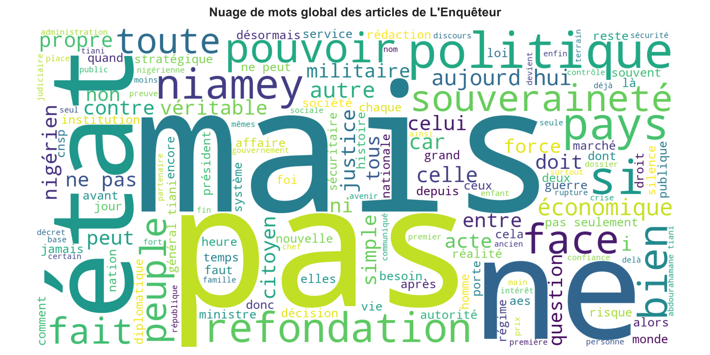
> 📝 **Interprétation :**
> *Nous observons sur ce nuage de mots l'importance des mots qui indiquent la négaion ou le rejet. Ceci peut-être interprété comme une caracteristique propore de ce journal à vouloir dénoncer les mauvaises pratiques et les maux dont souffre notre société et la sphere politique de notre pays. La conjonction "mais" très présente dans ces textes renvoie à l'esprit critique qu'incarnent les éditeurs.*
---

#### Figure 1 : Nuage de mots global (filtré)
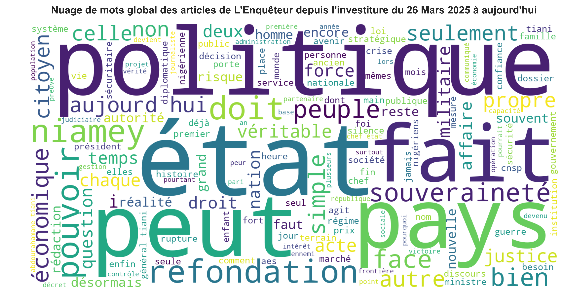
> 📝 **Interprétation :**
> *Pour comprendre en profondeur autour de quoi oscillent les écrits des éditeurs, nous avons jugé utile de mettre les conjonctions négatives en STOP-WORDS c'est à dire mots vides. Cela nous a permis de voir les mots les plus signifiants autour desquels tournent les discours. Cette figure montre montre des mots en grand(fréquents) parmi lesquels Principalement 3 attirent notre attention:*
> *POLITIQUE: Ce qui se traduit par un discours qui vise beaucoup plus la tendance politique;*
> *ETAT: Ceci est la cible principale du journal;*
> *SOUVERENAITE: C'est l'un des thèmes centraux des articles. Nous rappelons que la quête de souverenaité était le dessein principal du COUP D'ETAT de 26 Juillet 2023.*

---

#### Figure 2 : Top 20 des mots les plus fréquents
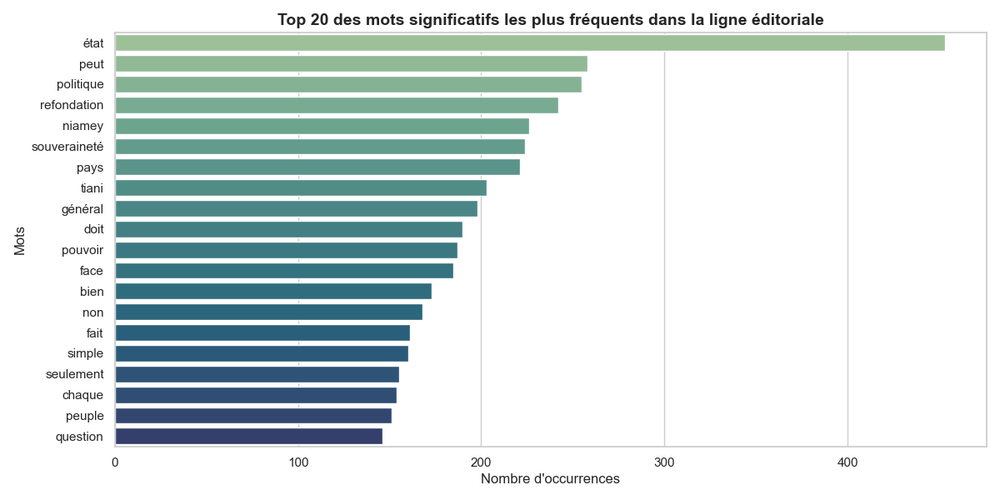
> 📝 **Interprétation :**
> *Cette figure nous donne précisemment les mots les plus fréquents Nous avons le mot état qui est classé en tête confirmant bien évidemment la cible de l'éditeur. Des mots tels que "Souverenaité" et "réfondation" , sont aussi frequemment cités. Ceci est une confirmation de la cible de ce journal sachant bien évidemment que ces mots précédemment évoqués constituent le champs lexical dominant des discours du gouvernement de la transition.*

---

### II. Analyse de Sentiment & Intensité

#### Figure 4 : Distribution de la Polarité (Le ton général)
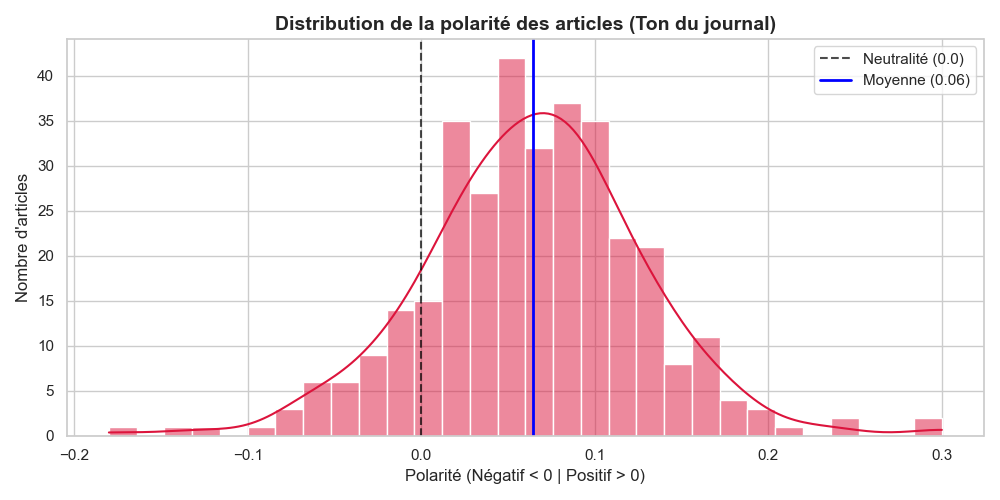
> 📝 **Interprétation :**
> *Le ton global du journal comme nous pouvons l'observer reste en moyenne positif(0.06) bien que ça soit plus proche de la neutralité. Nous pouvons observer également un côté négatif alimenté par peu d'articles par rapport au côté positif. On peut noter que parmi les artciles positifs la majorité reste au dessus de la moyenne et sont donc très positifs alors que ceux qui sont neutre restent peu. Ces résultats ne sont en aucun cas en contradiction avec notre prémière interprétation de nuages de mots contenant les conjonctions et mots évidemment négatifs, par contre ils viennent clarifier et compléter la tonalité des articles. Ce traitement de ton dépasse le cadre des nuages où les mots sont répresentés de manière isolés: les mots sont pris dans leurs contextes et sont donc bien évalués en polarité*

---

#### Figure 5 : Positionnement sémantique (Polarité vs Subjectivité)
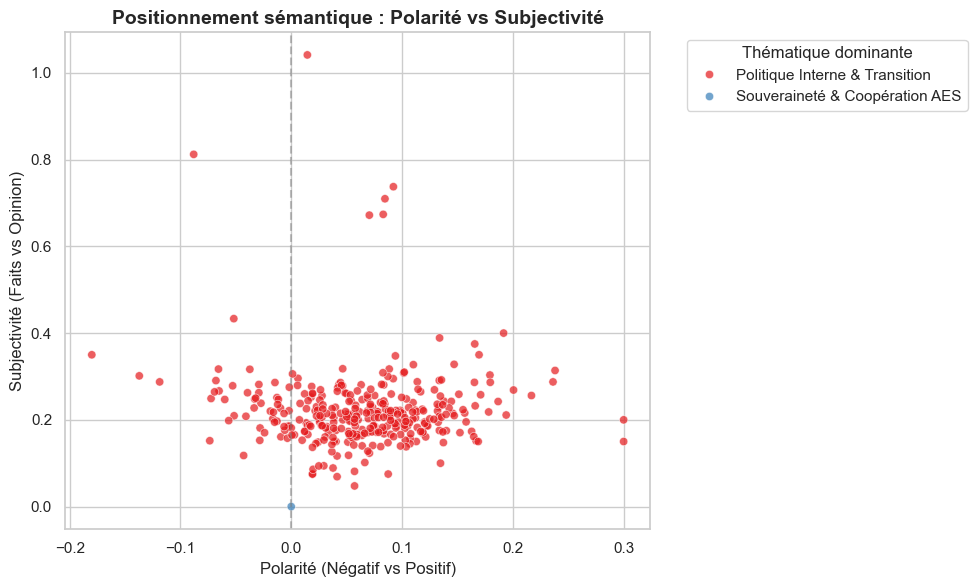
> 📝 **Interprétation :**
> *Cette figure de croisement Subjectivité vs Polarité met en évidence un fait très intéressant: beaucoup d'articles(majorité) sont écrits de manière subjective et positive( c'est à dire ils rélatent que des faits avec les bons termes et de manière constructive) sur la politique interne actuelle du pays conduite par le gouvernement de la transition*

---

### III. Dynamique Temporelle

#### Figure 6 : Évolution de l'indice de sentiment au cours du temps
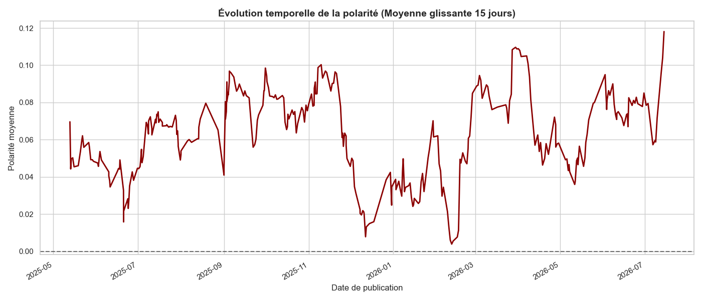
> 📝 **Interprétation :**
> *Les pics et les creux de la courbe de polarité glissante doivent être réliés avec des événements réels de l'actualité nigérienne sur la période 2025-2026, afin de garantir une bonne interpretabilité. Il n'est pas à ignorer que nous restons toujours dans du positif en moyenne*

---

### IV. Croisement avec l'Engagement (Métadonnées)

#### Figure 7 : Virulence du post vs Taux de partage
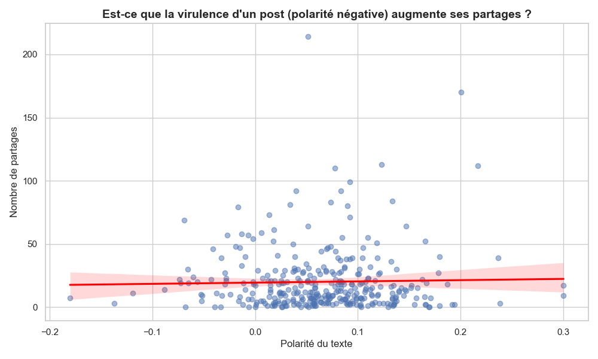
> 📝 **Interprétation :**
> *Il semble que les articles négatifs sont les moins partagés(n'atteignant pas les 100 partages par article). Ceci peut donner une idée comme quoi les gens ont peur de paratger le discours du journal lorsqu'il est moins positif en régime non démocratique(peur de l'interpélation) ou bien simple envie de ne pas aider à véhiculer les vérités amères sur le Niger aux yeux du monde entier. Plusieurs autres hypothèses peuvent être émises à ce point.*

---

#### Figure 8 : Profil des réactions sur Facebook
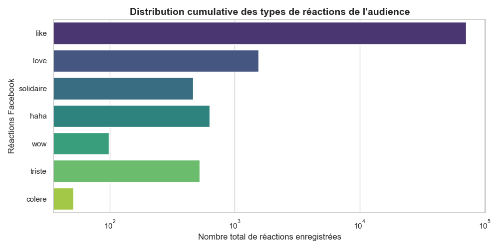
> 📝 **Interprétation :**
> *Les likes sont logiquement la réaction la plus fréquente et c'est de loin plus important que tous les autres types des réactions. Cela traduit le soutien de l'audience d et le paratage de pensées sur les faits qu'expose et critique l'ênquêteur. La réaction de colère est faiblement représentée, cela confirme une fois de plus la positivité de la majeure partie des articles. Il y'a plus de plaisir et d'espoir à prendre en lisant l'enquêteur que de tristesse, de colère et du dégoût. Les gens voient en cet éditorial un moyen de faire entendre leurs pensées et voix indirectement.*

---

### V. Thématiques & Sentiments

#### Figure 9 : Volume de publications et polarité par Thématique
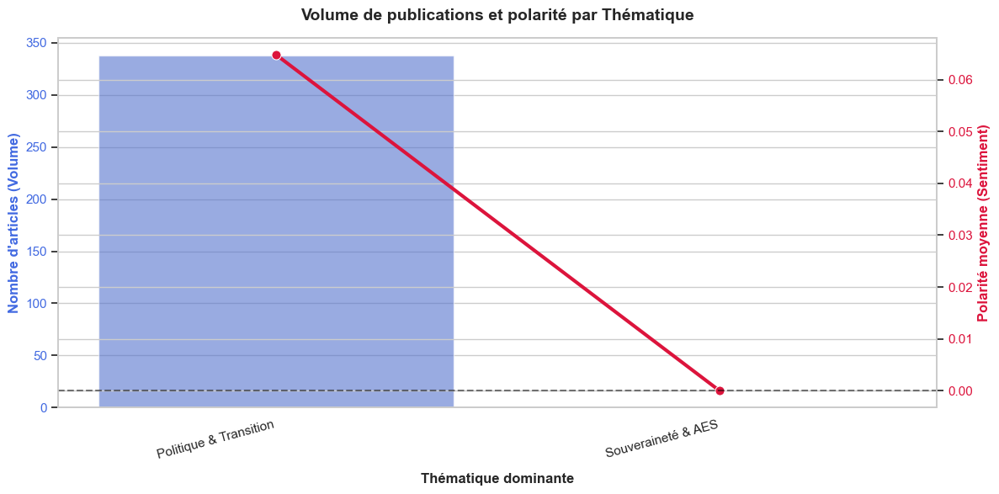
> 📝 **Interprétation :**
> *Les articles du journal concernent la politique interne et le gouvernement de transition avec un sentiment positif, l'AES reste beaucoup moins mentionnée.*

---

#### Figure 10 : Niveau d'engagement moyen des lecteurs par Thématique
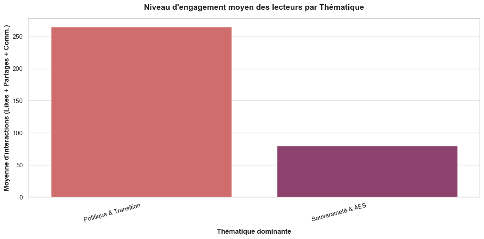
> 📝 **Interprétation :**
> *Il va de soi  que le thème le plus dominant démeure le plus engageant, sinon le journal allait peut-être arrêter de produire des textes qui concerne la politique interne.*

---

#### Annexe 1 : Corrélation entre types d'engagement
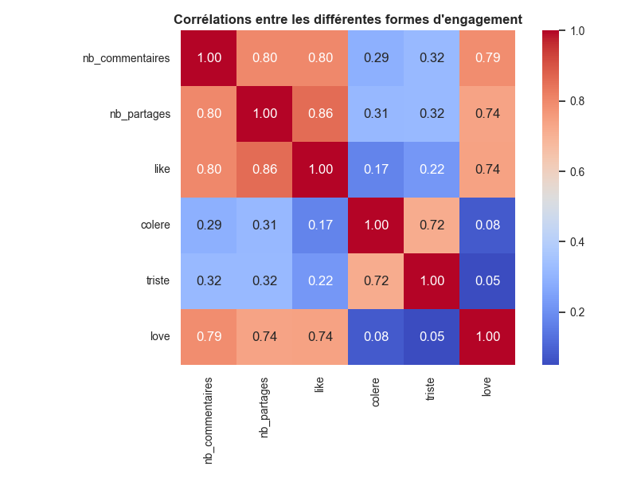

#### Annexe 2 : Rythme de publication du Journal
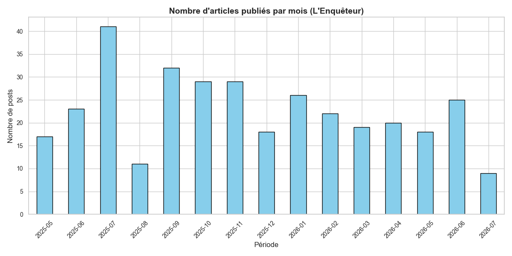

---
#### Conclusion:
Les résultats de cette étude confirment la perception de l'audience nigérienne qui pense que l'enquêteur dénonce les maux qui règnent au sein de la politique du pays. Ce qui est surprenant c'est de voir à quel point cet éditorial est en global très positif et constructif dans son discours. S'il y'a bien un journal auquel attention et soutien dévraient être accordés , c'est bien ce journal unique et distingué au Niger, pendant cette période où personne n'ose se prononcer publiquement pour hisser le drapeau de la vérité. Pourquoi l'éditeur en chef de ce journal s'est-il fait interpellé en ce mois de juillet 2026 alors que ses articles sont positifs , objectifs et validés par l'opinion publique ? 

## ⚖️ Droits d'auteur & Propriété Intellectuelle
Toutes les analyses, méthodologies de nettoyage NLP, architectures de code et représentations graphiques présentées dans ce dépôt sont l'œuvre originale de son auteur.

**© 2026 - GUERGOU GAGARA Abdoul-Samah**  
*Étudiant Ingénieur en Économie Appliquée, Statistique et Big Data (INSEA).*  
Tous droits réservés.
